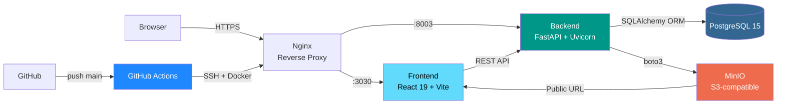

# WallyDev — Portfolio & Blog

[](LICENSE)
[](https://react.dev)
[](https://fastapi.tiangolo.com)
[](https://docker.com)
[](https://postgresql.org)
[](https://wallydev.dev)

Portfolio personal + Blog + CMS admin de **Waldir Apaza** — Fullstack Web Developer con +3 años de experiencia en React, Python y DevOps.

**Live:** https://wallydev.dev | **GitHub:** https://github.com/wallydevgg/Portfolio

---

## ✨ Features

- **React 19 + Vite** — SPA moderna con HMR y builds optimizados
- **SCSS 7-1 Architecture** — Mantenible, escalable, variables globales
- **i18n EN/ES** — LinguiJS con catálogos `.po` pre-compilados
- **Portfolio CMS** — CRUD dinámico para Experience, Skills (con categorías), Projects
- **Blog CMS** — Editor TipTap, categorías, tags, estados published/draft
- **Admin Dashboard** — Protegido con JWT, accesible en `/dashboard`
  - Experience management (empresa, fecha, responsabilidades)
  - Skills management (categorías + items con nivel %)
  - Projects management con carga de imágenes a MinIO
  - Blog Posts CRUD (existente)
  - Settings (placeholder para futuras opciones)
- **Image Storage** — MinIO S3-compatible dockerizado
- **Dark mode** — Por defecto, con toggle manual
- **SEO** — Meta tags dinámicos, Open Graph, JSON-LD
- **CI/CD** — Docker + GitHub Actions, deploy automático en push a `main`
- **RSS Feed** — `/api/v1/posts/rss.xml`

---

## 🏗️ Arquitectura



### Estructura del proyecto

```
Portfolio/
├── frontend/                     # React 19 SPA
│   ├── src/
│   │   ├── pages/
│   │   │   ├── Home/             # Hero, Experience, Skills, Projects, About, Contact
│   │   │   │   └── Sections/     # Fetch API en lugar de hardcoded
│   │   │   ├── Blog/             # BlogPage pública
│   │   │   ├── Dashboard/
│   │   │   │   ├── Posts/        # Blog CRUD
│   │   │   │   ├── Experience/   # CRUD empresas/roles
│   │   │   │   ├── Skills/       # CRUD categorías + skills
│   │   │   │   ├── Projects/     # CRUD con upload a MinIO
│   │   │   │   └── Settings/     # Placeholder futuro
│   │   │   └── Login/            # Auth admin
│   │   ├── features/
│   │   │   ├── blog/             # useBlogApi hook
│   │   │   └── portfolio/        # usePortfolioApi hook
│   │   ├── components/
│   │   │   ├── ui/               # Header, Footer, Layout, Switch
│   │   │   ├── SEO/              # PageSEO (meta tags + JSON-LD)
│   │   │   └── auth/             # ProtectedRoute
│   │   ├── layouts/              # DashboardLayout
│   │   ├── contexts/             # AuthContext (JWT), ToastContext
│   │   ├── locales/              # en/ y es/ — archivos .po compilados
│   │   └── router/               # Router.jsx
│   ├── lingui.config.ts
│   ├── vite.config.js
│   └── package.json
│
├── backend/                      # FastAPI REST API
│   ├── domains/
│   │   ├── blog/                 # Post, Category, Tag + CRUD + RSS
│   │   ├── users/                # JWT login + User model
│   │   └── portfolio/
│   │       ├── models.py         # Experience, SkillCategory, Skill, Project
│   │       ├── schemas.py        # Pydantic schemas (CRUD)
│   │       └── router.py         # Endpoints + /upload
│   ├── core/
│   │   ├── config.py             # Settings desde .env
│   │   ├── database.py           # SQLAlchemy session
│   │   ├── security.py           # JWT + bcrypt
│   │   └── storage.py            # MinIO S3 client
│   ├── alembic/
│   │   ├── env.py
│   │   └── versions/             # Migrations
│   ├── scripts/                  # seed_admin.py
│   └── main.py
│
├── docker-compose.yml            # Dev: frontend, backend, postgres, minio
├── docker-compose.prod.yml       # Prod: nginx, backend, postgres
├── .github/workflows/
│   └── fullstack-deploy.yml      # Build → Push → SSH → Docker up
└── .env.example                  # Template de variables
```

---

## 🚀 Cómo correr localmente

### Prerequisitos

- **Node.js** 20+
- **Python** 3.10+
- **Docker** & Docker Compose (recomendado)
- **PostgreSQL** 15+ (si corres sin Docker)

### Opción 1: Docker (recomendado)

```bash
# 1. Clonar
git clone https://github.com/wallydevgg/Portfolio.git
cd Portfolio

# 2. Configurar variables
cp .env.example .env
# Editar .env con tus credenciales locales

# 3. Levantar servicios
docker-compose up -d

# Frontend:   http://localhost:3030
# Backend:    http://localhost:8003
# API Docs:   http://localhost:8003/docs
# MinIO:      http://localhost:9001 (console)
# MinIO API:  http://localhost:9000
```

**Servicios incluidos en `docker-compose.yml` (dev):**
- `frontend` — Node.js con Vite HMR
- `backend` — FastAPI + Uvicorn
- `postgres` — Base de datos
- `minio` — S3-compatible storage con bucket `portfolio`

El entorno Docker usa una red interna. PostgreSQL es accesible como `postgres:5432` desde los contenedores.

### Opción 2: Manual

**Frontend:**
```bash
cd frontend
npm install

# Compilar catálogos i18n (obligatorio antes del primer run)
npm run messages:extract
npm run compile

# Dev server
npm run dev
```

**Backend:**
```bash
cd backend
python -m venv venv
source venv/bin/activate   # Windows: venv\Scripts\activate
pip install -r requirements.txt

# Crear .env en la raíz del proyecto (ver .env.example)
uvicorn main:app --reload --port 8003
```

### Variables de entorno

```env
# Puertos
FRONTEND_PORT=3030
BACKEND_PORT=8003

# Base de datos
POSTGRES_SERVER=shared-db
POSTGRES_USER=portfolio_user
POSTGRES_PASSWORD=tu_password_segura
POSTGRES_DB=portfolio
POSTGRES_PORT=5432

# Seguridad JWT
SECRET_KEY=genera-un-string-aleatorio-de-32-chars
ALGORITHM=HS256

# Admin dashboard
ADMIN_USERNAME=admin
ADMIN_EMAIL=admin@example.com
ADMIN_PASSWORD=tu_password_segura

# MinIO (S3-compatible storage)
MINIO_ROOT_USER=minioadmin
MINIO_ROOT_PASSWORD=minioadmin
MINIO_ENDPOINT=minio:9000            # Interno en Docker
MINIO_PUBLIC_URL=http://localhost:9000  # URL pública para imágenes
MINIO_BUCKET=portfolio

# CORS
BACKEND_CORS_ORIGINS=["http://localhost:3030","https://wallydev.dev"]
```

Si prefieres no guardar el password en texto plano, usa `ADMIN_PASSWORD_HASH` en lugar de `ADMIN_PASSWORD`.

**Generar hash de password admin:**
```bash
cd backend
python -c "from core.security import get_password_hash; print(get_password_hash('tu_password'))"
```

**Seed del admin en DB:**
```bash
docker compose exec -T backend python -m scripts.seed_admin
```

---

## 💼 Portfolio CMS

El sistema permite gestionar dinámicamente la información del portfolio desde el dashboard (`/dashboard`):

### Experience Management
- Crear/editar/eliminar experiencias laborales
- Campos: empresa, fecha (ej. "Jun 2020 - 2024"), título, responsabilidades (array)
- Se consume en Home desde `/api/v1/portfolio/experience`

### Skills Management
- Crear categorías custom (Frontend, Backend, DevOps, etc.)
- Dentro de cada categoría: skills con nombre y nivel (0-100%)
- Se consume en Home desde `/api/v1/portfolio/skills`

### Projects Management
- Crear/editar proyectos con:
  - Título, descripción, tech stack (array de tags)
  - Imagen: upload automático a MinIO → devuelve URL pública
  - Links: website + GitHub (opcionales)
- Se consume en Home desde `/api/v1/portfolio/projects`

### Flujo típico:
1. Login en `/dashboard`
2. Navegar a Experience/Skills/Projects
3. Crear/editar datos (se guardan en PostgreSQL)
4. Imágenes de proyectos se almacenan en MinIO
5. Home sections consumen la API automáticamente

---

## 🌍 Internacionalización (i18n)

El proyecto utiliza **LinguiJS v5** para la internacionalización. Para evitar problemas con el extractor dinámico y garantizar una correspondencia exacta en los catálogos compilados, utilizamos **IDs explícitos** para la mayoría de textos.

### Flujo de trabajo para agregar/editar textos:

1. **Uso de macros:** En el código (ej. en componentes o hooks), utiliza la macro `t` con un `id` explícito y el `message` por defecto (en inglés):
   ```jsx
   import { t } from "@lingui/macro";
   
   // Correcto
   const text = t({ id: "section.title", message: "Section Title" });
   
   // En JSX
   <h1>{t({ id: "section.title", message: "Section Title" })}</h1>
   ```

2. **Extracción:** Ejecuta el comando de extracción para generar/actualizar los archivos `.po` localizados en `src/locales/en/messages.po` y `es/messages.po`.
   ```bash
   npm run messages:extract
   ```
   *(Este comando utiliza la bandera `--clean` para eliminar IDs obsoletos).*

3. **Traducción:** Rellena los campos `msgstr ""` vacíos en los archivos `messages.po` recién generados.

4. **Compilación:** Es **obligatorio** compilar los archivos `.po` a `.ts` para que Vite pueda consumirlos:
   ```bash
   npm run compile
   ```

---

## 📖 API Reference

Docs interactivas en **http://localhost:8003/docs**

### Auth
| Método | Ruta | Auth | Descripción |
|--------|------|------|-------------|
| `POST` | `/api/v1/login/access-token` | — | Login admin |

### Blog
| Método | Ruta | Auth | Descripción |
|--------|------|------|-------------|
| `GET` | `/api/v1/posts/` | — | Posts publicados |
| `GET` | `/api/v1/posts/rss.xml` | — | Feed RSS |
| `GET` | `/api/v1/posts/{id}` | — | Post por ID |
| `POST` | `/api/v1/posts/` | JWT | Crear post |
| `PUT` | `/api/v1/posts/{id}` | JWT | Actualizar post |
| `DELETE` | `/api/v1/posts/{id}` | JWT | Eliminar post |

### Portfolio — Experience
| Método | Ruta | Auth | Descripción |
|--------|------|------|-------------|
| `GET` | `/api/v1/portfolio/experience` | — | Listar experiencias |
| `POST` | `/api/v1/portfolio/experience` | JWT | Crear experiencia |
| `PUT` | `/api/v1/portfolio/experience/{id}` | JWT | Actualizar experiencia |
| `DELETE` | `/api/v1/portfolio/experience/{id}` | JWT | Eliminar experiencia |

### Portfolio — Skills
| Método | Ruta | Auth | Descripción |
|--------|------|------|-------------|
| `GET` | `/api/v1/portfolio/skills` | — | Listar categorías + skills |
| `POST` | `/api/v1/portfolio/skills/categories` | JWT | Crear categoría |
| `PUT` | `/api/v1/portfolio/skills/categories/{id}` | JWT | Actualizar categoría |
| `DELETE` | `/api/v1/portfolio/skills/categories/{id}` | JWT | Eliminar categoría |
| `POST` | `/api/v1/portfolio/skills/items` | JWT | Crear skill |
| `PUT` | `/api/v1/portfolio/skills/items/{id}` | JWT | Actualizar skill |
| `DELETE` | `/api/v1/portfolio/skills/items/{id}` | JWT | Eliminar skill |

### Portfolio — Projects
| Método | Ruta | Auth | Descripción |
|--------|------|------|-------------|
| `GET` | `/api/v1/portfolio/projects` | — | Listar proyectos |
| `POST` | `/api/v1/portfolio/projects` | JWT | Crear proyecto |
| `PUT` | `/api/v1/portfolio/projects/{id}` | JWT | Actualizar proyecto |
| `DELETE` | `/api/v1/portfolio/projects/{id}` | JWT | Eliminar proyecto |

### Upload
| Método | Ruta | Auth | Descripción |
|--------|------|------|-------------|
| `POST` | `/api/v1/portfolio/upload` | JWT | Subir imagen a MinIO → devuelve URL pública |

---

## 🐳 Docker & Deploy

```bash
# Build manual
docker build -t portfolio_frontend ./frontend
docker build -t portfolio_backend ./backend

# Producción en VPS
docker-compose -f docker-compose.prod.yml up -d

# Logs
docker-compose logs -f
```

**GitHub Actions** despliega automáticamente en cada push a `main`. Secrets requeridos en el repo (configurar en *Settings → Secrets and variables → Actions*):

| Secret | Descripción | Cómo obtener |
|--------|-------------|--------------|
| `SSH_HOST` | IP o dominio del VPS | Panel VPS |
| `SSH_USER` | Usuario SSH | Panel VPS |
| `SSH_PORT` | Puerto SSH | Panel VPS |
| `INPUT_PASSWORD` | Password SSH | Panel VPS |
| `DB_USER` | Usuario PostgreSQL de prod | Base de datos existente |
| `DB_PASSWORD` | Password PostgreSQL de prod | Base de datos existente |
| `SECRET_KEY` | Clave secreta JWT (mín. 32 chars) | `python -c "import secrets; print(secrets.token_hex(32))"` |
| `ADMIN_USERNAME` | Usuario del dashboard admin | Elegir libremente |
| `ADMIN_EMAIL` | Email del admin | Elegir libremente |
| `ADMIN_PASSWORD` | Password del admin para seed inicial | Elegir libremente |
| `ADMIN_PASSWORD_HASH` | Alternativa al password plano | `cd backend && python -c "from core.security import get_password_hash; print(get_password_hash('tu_password'))"` |

> **Nota:** `SECRET_KEY`, `ADMIN_USERNAME`, `ADMIN_PASSWORD` y `ADMIN_PASSWORD_HASH` nunca se commitean. Se generan localmente y se pegan directo en GitHub Secrets o en el `.env` del VPS.

---

## 🛠️ Stack técnico

| Capa | Tecnología |
|------|------------|
| Frontend | React 19, Vite, SCSS 7-1, React Router 7 |
| i18n | LinguiJS 5 (EN + ES, `.po` catalogs) |
| Editor | TipTap 3 (rich text) |
| Iconos | Lucide React, FontAwesome 6 |
| Backend | FastAPI, SQLAlchemy 2, Pydantic v2 |
| Base de datos | PostgreSQL 15 |
| Storage | MinIO (S3-compatible) |
| Auth | JWT (PyJWT), Passlib + bcrypt |
| Migrations | Alembic |
| Deploy | Docker, Nginx, GitHub Actions |
| VPS | Hetzner + HestiaCP |

---

## 🔐 Seguridad

- Sin defaults hardcodeados — todos los secrets vienen del `.env`
- CORS whitelisting explícito
- JWT con expiración configurable
- Passwords con bcrypt (cost factor 12)
- TipTap sanitiza HTML para prevenir XSS
- `.env` en `.gitignore` — nunca commiteado

---

## 📝 Licencia

MIT — ver [LICENSE](LICENSE)

## 📧 Contacto

- **Email:** waliuxd@gmail.com
- **LinkedIn:** [Waldir Apaza](https://linkedin.com/in/waldirxam)
- **GitHub:** [@wallydevgg](https://github.com/wallydevgg)
- **Web:** [wallydev.dev](https://wallydev.dev)

---

*Made with ☕ by Waldir Apaza*
