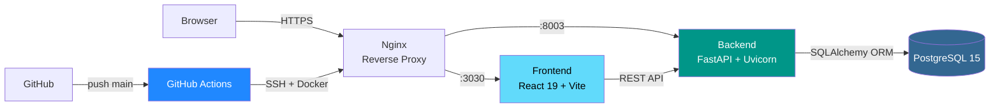

# WallyDev — Portfolio & Blog

[](LICENSE)
[](https://react.dev)
[](https://fastapi.tiangolo.com)
[](https://docker.com)
[](https://postgresql.org)
[](https://wallydev.dev)

Portfolio personal + Blog + CMS admin de **Waldir Apaza** — Fullstack Web Developer con +3 años de experiencia en React, Python y DevOps.

**Live:** https://wallydev.dev | **GitHub:** https://github.com/wallydevgg/Portfolio

---

## ✨ Features

- **React 19 + Vite** — SPA moderna con HMR y builds optimizados
- **Tailwind CSS 100%** — Migrado completamente desde SCSS
- **i18n EN/ES** — LinguiJS con catálogos `.po` pre-compilados
- **Blog CMS** — Editor TipTap, categorías, tags, estados published/draft
- **Admin Dashboard** — Protegido con JWT, accesible en `/dashboard`
- **Dark mode** — Por defecto, con toggle manual
- **SEO** — Meta tags dinámicos, Open Graph, JSON-LD
- **CI/CD** — Docker + GitHub Actions, deploy automático en push a `main`
- **RSS Feed** — `/api/v1/posts/rss.xml`

---

## 🏗️ Arquitectura



### Estructura del proyecto

```
Portfolio/
├── frontend/                     # React 19 SPA
│   ├── src/
│   │   ├── pages/
│   │   │   ├── Home/             # Hero, Experience, Skills, Projects, About, Contact
│   │   │   ├── Blog/             # BlogPage pública
│   │   │   ├── Dashboard/        # Posts CRUD admin
│   │   │   └── Login/            # Auth admin
│   │   ├── components/
│   │   │   ├── ui/               # Header, Footer, Layout, Switch
│   │   │   ├── SEO/              # PageSEO (meta tags + JSON-LD)
│   │   │   └── auth/             # ProtectedRoute
│   │   ├── layouts/              # DashboardLayout
│   │   ├── contexts/             # AuthContext (JWT)
│   │   ├── locales/              # en/ y es/ — archivos .po
│   │   ├── Content/              # projects.json, data estática
│   │   └── router/               # Router.jsx
│   ├── lingui.config.ts
│   ├── tailwind.config.js
│   └── vite.config.js
│
├── backend/                      # FastAPI REST API
│   ├── domains/
│   │   ├── blog/                 # Post, Category, Tag + CRUD + RSS
│   │   ├── users/                # JWT login
│   │   └── portfolio/            # Datos del portfolio
│   ├── core/
│   │   ├── config.py             # Settings desde .env (sin defaults hardcodeados)
│   │   ├── database.py           # SQLAlchemy session
│   │   └── security.py           # JWT + bcrypt
│   └── main.py
│
├── docker-compose.yml            # Dev local
├── docker-compose.prod.yml       # Producción
├── .github/workflows/
│   └── fullstack-deploy.yml      # Build → Push → SSH → Docker up
└── .env.example                  # Template de variables
```

---

## 🚀 Cómo correr localmente

### Prerequisitos

- **Node.js** 20+
- **Python** 3.10+
- **Docker** & Docker Compose (recomendado)
- **PostgreSQL** 15+ (si corres sin Docker)

### Opción 1: Docker (recomendado)

```bash
# 1. Clonar
git clone https://github.com/wallydevgg/Portfolio.git
cd Portfolio

# 2. Configurar variables
cp .env.example .env
# Editar .env con tus credenciales locales

# 3. Levantar servicios
docker-compose up -d

# Frontend: http://localhost:3030
# Backend:  http://localhost:8003
# API Docs: http://localhost:8003/docs
```

### Opción 2: Manual

**Frontend:**
```bash
cd frontend
npm install

# Compilar catálogos i18n (obligatorio antes del primer run)
npm run messages:extract
npm run compile

# Dev server
npm run dev
```

**Backend:**
```bash
cd backend
python -m venv venv
source venv/bin/activate   # Windows: venv\Scripts\activate
pip install -r requirements.txt

# Crear .env en la raíz del proyecto (ver .env.example)
uvicorn main:app --reload --port 8003
```

### Variables de entorno

```env
# Puertos
FRONTEND_PORT=3030
BACKEND_PORT=8003

# Base de datos
POSTGRES_SERVER=localhost
POSTGRES_USER=portfolio_user
POSTGRES_PASSWORD=tu_password_segura
POSTGRES_DB=portfolio
POSTGRES_PORT=5432

# Seguridad JWT
SECRET_KEY=genera-un-string-aleatorio-de-32-chars
ALGORITHM=HS256

# Admin dashboard
ADMIN_USERNAME=admin
ADMIN_PASSWORD_HASH=<hash bcrypt — ver abajo>

# CORS
BACKEND_CORS_ORIGINS=["http://localhost:3030","https://wallydev.dev"]
```

**Generar hash de password admin:**
```bash
cd backend
python -c "from core.security import get_password_hash; print(get_password_hash('tu_password'))"
```

---

## 📖 API Reference

Docs interactivas en **http://localhost:8003/docs**

| Método | Ruta | Auth | Descripción |
|--------|------|------|-------------|
| `GET` | `/api/v1/posts/` | — | Posts publicados |
| `GET` | `/api/v1/posts/rss.xml` | — | Feed RSS |
| `GET` | `/api/v1/posts/{id}` | — | Post por ID |
| `POST` | `/api/v1/posts/` | JWT | Crear post |
| `PUT` | `/api/v1/posts/{id}` | JWT | Actualizar post |
| `DELETE` | `/api/v1/posts/{id}` | JWT | Eliminar post |
| `POST` | `/api/v1/login/access-token` | — | Login admin |

---

## 🐳 Docker & Deploy

```bash
# Build manual
docker build -t portfolio_frontend ./frontend
docker build -t portfolio_backend ./backend

# Producción en VPS
docker-compose -f docker-compose.prod.yml up -d

# Logs
docker-compose logs -f
```

**GitHub Actions** despliega automáticamente en cada push a `main`. Secrets requeridos en el repo (configurar en *Settings → Secrets and variables → Actions*):

| Secret | Descripción | Cómo obtener |
|--------|-------------|--------------|
| `SSH_HOST` | IP o dominio del VPS | Panel VPS |
| `SSH_USER` | Usuario SSH | Panel VPS |
| `SSH_PORT` | Puerto SSH | Panel VPS |
| `INPUT_PASSWORD` | Password SSH | Panel VPS |
| `DB_USER` | Usuario PostgreSQL de prod | Base de datos existente |
| `DB_PASSWORD` | Password PostgreSQL de prod | Base de datos existente |
| `SECRET_KEY` | Clave secreta JWT (mín. 32 chars) | `python -c "import secrets; print(secrets.token_hex(32))"` |
| `ADMIN_USERNAME` | Usuario del dashboard admin | Elegir libremente |
| `ADMIN_PASSWORD_HASH` | Hash bcrypt del password admin | `cd backend && python -c "from core.security import get_password_hash; print(get_password_hash('tu_password'))"` |

> **Nota:** `SECRET_KEY`, `ADMIN_USERNAME` y `ADMIN_PASSWORD_HASH` nunca se commitean. Se generan localmente y se pegan directo en GitHub Secrets — el workflow los inyecta en el `.env` del VPS en cada deploy.

---

## 🛠️ Stack técnico

| Capa | Tecnología |
|------|------------|
| Frontend | React 19, Vite, Tailwind CSS, React Router 7 |
| i18n | LinguiJS 5 (EN + ES) |
| Editor | TipTap 3 (rich text) |
| Iconos | Lucide React, FontAwesome 6 |
| Backend | FastAPI, SQLAlchemy 2, Pydantic v2 |
| Base de datos | PostgreSQL 15 |
| Auth | JWT (PyJWT), Passlib + bcrypt |
| Deploy | Docker, Nginx, GitHub Actions |
| VPS | Hetzner + HestiaCP |

---

## 🔐 Seguridad

- Sin defaults hardcodeados — todos los secrets vienen del `.env`
- CORS whitelisting explícito
- JWT con expiración configurable
- Passwords con bcrypt (cost factor 12)
- TipTap sanitiza HTML para prevenir XSS
- `.env` en `.gitignore` — nunca commiteado

---

## 📝 Licencia

MIT — ver [LICENSE](LICENSE)

## 📧 Contacto

- **Email:** waliuxd@gmail.com
- **LinkedIn:** [Waldir Apaza](https://linkedin.com/in/waldirxam)
- **GitHub:** [@wallydevgg](https://github.com/wallydevgg)
- **Web:** [wallydev.dev](https://wallydev.dev)

---

*Made with ☕ by Waldir Apaza*
